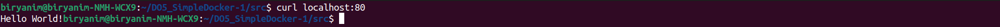

# Simple Docker
## Part 1. Готовый докер
* Возьмем официальный докер-образ с **nginx** и выкачай его при помощи `docker pull`
    
* Проверим наличие докер-образа через `docker images`
    
* Запустим докер-образ через `docker run -d [image_id|repository]`
    
* Проверим, что образ запустился через `docker ps`
    
* Посмотрим информацию о контейнере через `docker inspect [container_id|container_name]`
    
* По выводу команды определим:
    * размер контейнера
        
    * список замапленных портов
        
    * ip контейнера
        
* Остановим докер контейнер через `docker stop [container_id|container_name]`
    
* Проверим, что контейнер остановился через `docker ps`
    
* Запустим докер с портами 80 и 443 в контейнере, замапленными на такие же порты на локальной машине
    
* Проверим, что в браузере по адресу *localhost:80* доступна стартовая страница **nginx**
    
* Перезапустим докер контейнер через `docker restart [container_id|container_name]`
    
* Проверим, что контейнер запустился.
    

## Part 2. Операции с контейнером
* Прочитаем конфигурационный файл *nginx.conf* внутри докер контейнера через команду *exec*
    
* Создадим на локальной машине файл *nginx.conf* и настроем в нем по пути */status* отдачу страницы статуса сервера **nginx**
    
* Скопируем созданный файл *nginx.conf* внутрь докер-образа через команду `docker cp`
    
* Перезапустим **nginx** внутри докер-образа через команду *exec*
    
* Проверим, что по адресу *localhost:80/status* отдается страничка со статусом сервера **nginx**
    
* Экспортируем контейнер в файл *container.tar* через команду *export* и остановим контейнер
    
* Удалим образ через `docker rmi [image_id|repository]`, не удаляя перед этим контейнеры
    
* Удалим остановленный контейнер
    
* Импортируем контейнер обратно через команду *import*
    
* Запустим импортированный контейнер и проверим, что по адресу *localhost:80/status* отдается страничка со статусом сервера **nginx**.
    
    

## Part 3. Мини веб-сервер
* Напишем мини-сервер на **C** и **FastCgi**, который будет возвращать простейшую страничку с надписью `Hello World!`
    
* Запустим написанный мини-сервер через *spawn-fcgi* на порту 8080
    
* Напишем свой *nginx.conf*, который будет проксировать все запросы с 81 порта на *127.0.0.1:8080*. 
    
* Перезапустим nginx с помощью команды `sudo nginx -s reload` и проверим, что в браузере по *localhost:81* отдается написанная тобой страничка
    
* Положим файл *nginx.conf* по пути *./nginx/nginx.conf* (это понадобится позже) 

## Part 4. Свой докер

* Напишем свой докер-образ, который:
    1) собирает исходники мини сервера на FastCgi из Части 3;
    2) запускает его на 8080 порту;
    3) копирует внутрь образа написанный ./nginx/nginx.conf;
    4) запускает nginx.
    
    Скрипт компилирующий мини-сервер на **C** и запускающий этот сервер через *spawn-fcgi* на порту 8080
    
* Соберем написанный докер-образ через docker build при этом указав имя и тег и
проверим через docker images, что все собралось корректно
    
* Запустим собранный докер-образ с маппингом 81 порта на 80 на локальной машине и маппингом папки ./nginx внутрь контейнера по адресу, где лежат конфигурационные файлы nginx'а (см. Часть 2)
    
* Проверим, что по localhost:80 доступна страничка написанного мини сервера
    
    
* Допишем в ./nginx/nginx.conf проксирование странички /status, по которой надо отдавать статус сервера nginx
    
* Перезапустим докер-образ и проверим, что теперь по *localhost:80/status* отдается страничка со статусом **nginx**
    
    

## Part 5. **Dockle**
* Просканируем образ из предыдущего задания через `dockle [image_id|repository]`
    
* Исправим образ так, чтобы при проверке через **dockle** не было ошибок и предупреждений
    
    

## Part 6. Базовый **Docker Compose**

* Напишем файл *docker-compose.yml*, с помощью которого:
     1) Поднимем докер-контейнер из [Части 5](#part-5-инструмент-dockle) _(он должен работать в локальной сети, т. е. не нужно использовать инструкцию **EXPOSE** и мапить порты на локальную машину)_.
     2) Поднимем докер-контейнер с **nginx**, который будет проксировать все запросы с 8080 порта на 81 порт первого контейнера. Для проксирования создадим config, который примонтируем в yml файле
        
     3) Замапим 8080 порт второго контейнера на 80 порт локальной машины.

* Проверим, что нет запущенных контейнеров
    

* Соберем и запустим проект с помощью команд `docker-compose build` и `docker-compose up` и проверим, что в браузере по *localhost:80* отдается написанная тобой страничка, как и ранее.
    